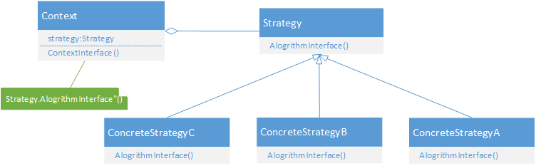
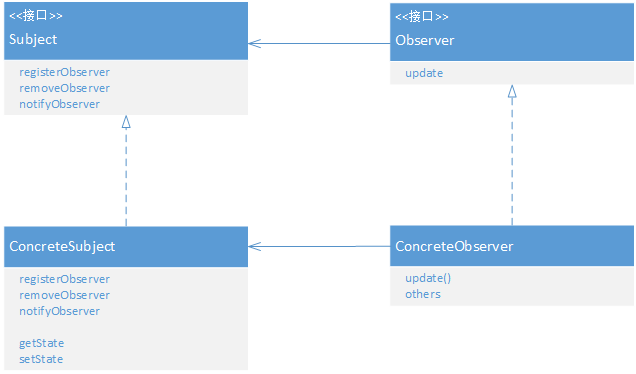
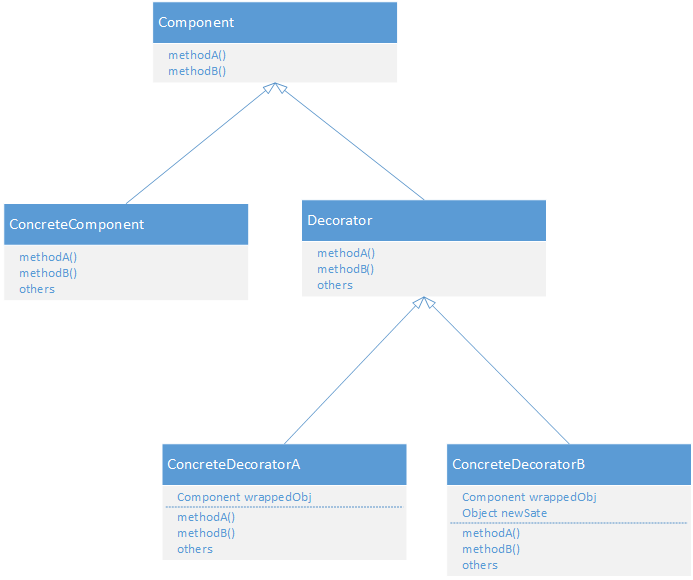

设计模式
=======
-------
1 策略模式
----------
	策略模式定义了算法簇，分别封装了起来，让它们之间可以互相替换，此模式让算法的变化独立于使用算法的客户。
使用策略模式时，是为了将系统中变化的部分取出并“封装”起来，使得其他部分不受影响。例如将变化的算法部分取出，进行封装，在算法需要变换的前提下，在运行时动态的替换掉算法即可。

Head First中，鸭子的fly和quack随着具体的鸭子实例发生变化，因此将其从Duck中抽取抽来作为接口。并对这两个接口进行若干的具体实现，并可动态的设置鸭子的各种fly和quack行为。
2 观察者模式
-----------
	观察者模式定义了对象之间的的一对多依赖，当一个对象改变状态时，它的所有依赖着都会收到通知并自动更新。
观察者中有一个主题对象Subject和若干具体的观察者对象Observer，Subject提供接口供注册和删除观察者，Observer提供update接口当主题状态改变时被调用。 Subject是有状态的，Observer使用这些状态，状态虽不属于Observer，但是这些Observer必须依赖Subject告诉它们状态何时改变。 当然在notify这些Observer时，可以选择使用Subject去push数据，也可以在Observer中pull过来。

Head First中的Weather Data就是主题，当期发现气象数据发生了变化后，便notify各广告版实现，数据的更新。 

此外Java的Swing中也用到了大量的观察者模式，当我们给JButton或者JPanel等注册ActionListener时，其实就是注册了Observer，当UI事件发生时，这些Observer便被notify了。
3 装饰者模式
---------
	装饰者模式动态的将责任附加到对象上，若要扩展功能，装饰者提供了比继承更有弹性的替代方案。
被装饰者总是被装饰着包装起来，因为装饰者必须能取代被装饰者，因此它们具有相同的类型。装饰者虽有着共同的类型，但并不继承被装饰者的行为，行为总是来自装饰者和基础组件，或与其它装饰者之间的组合关系。

Head First中，Beverage饮料类是一个基础类，在此基础上扩展了HouseBlend、DarkRoast、Espresso以及Decaf四种饮料，同时我们将调料类CondimentDecorator作为装饰者，装饰各种饮料，作为装饰者要具有相同的类型，因此CondimentDecorator也扩展自Beverage，同时增加了一个指向Beverage对象的引用。此时在CondimentDecorator基础上扩展了四种具体调料类来包装这些饮料，达到装饰目的。
