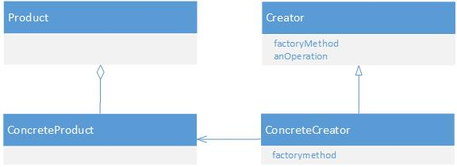
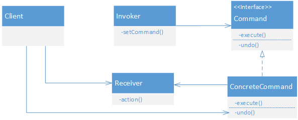
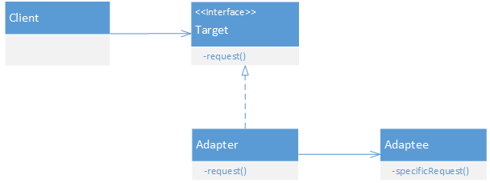
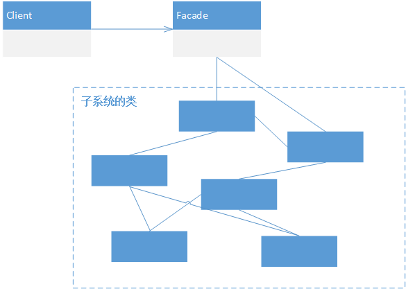

设计模式
=======
-------
1 策略模式
----------
	策略模式定义了算法簇，分别封装了起来，让它们之间可以互相替换，此模式让算法的变化独立于使用算法的客户。
使用策略模式时，是为了将系统中变化的部分取出并“封装”起来，使得其他部分不受影响。例如将变化的算法部分取出，进行封装，在算法需要变换的前提下，在运行时动态的替换掉算法即可。

Head First中，鸭子的fly和quack随着具体的鸭子实例发生变化，因此将其从Duck中抽取抽来作为接口。并对这两个接口进行若干的具体实现，并可动态的设置鸭子的各种fly和quack行为。
2 观察者模式
-----------
	观察者模式定义了对象之间的的一对多依赖，当一个对象改变状态时，它的所有依赖着都会收到通知并自动更新。
观察者中有一个主题对象Subject和若干具体的观察者对象Observer，Subject提供接口供注册和删除观察者，Observer提供update接口当主题状态改变时被调用。 Subject是有状态的，Observer使用这些状态，状态虽不属于Observer，但是这些Observer必须依赖Subject告诉它们状态何时改变。 当然在notify这些Observer时，可以选择使用Subject去push数据，也可以在Observer中pull过来。

Head First中的Weather Data就是主题，当期发现气象数据发生了变化后，便notify各广告版实现，数据的更新。 
此外Java的Swing中也用到了大量的观察者模式，当我们给JButton或者JPanel等注册ActionListener时，其实就是注册了Observer，当UI事件发生时，这些Observer便被notify了。
3 装饰者模式
---------
	装饰者模式动态的将责任附加到对象上，若要扩展功能，装饰者提供了比继承更有弹性的替代方案。
被装饰者总是被装饰着包装起来，因为装饰者必须能取代被装饰者，因此它们具有相同的类型。装饰者虽有着共同的类型，但并不继承被装饰者的行为，行为总是来自装饰者和基础组件，或与其它装饰者之间的组合关系。

Head First中，Beverage饮料类是一个基础类，在此基础上扩展了HouseBlend、DarkRoast、Espresso以及Decaf四种饮料，同时我们将调料类CondimentDecorator作为装饰者，装饰各种饮料，作为装饰者要具有相同的类型，因此CondimentDecorator也扩展自Beverage，同时增加了一个指向Beverage对象的引用。此时在CondimentDecorator基础上扩展了四种具体调料类来包装这些饮料，达到装饰目的。
4 工厂模式
---------
    工厂方法模式定义了一个创建对象的接口，但由于子类要决定实例化的类是哪一个。工厂方法让类把实例化推迟到了子类。

Head First中，Pizza是一个产品类，PizzaStore是一个创建者的抽象类，NYPizzaStore和ChicagoPizzaStore两个子类继承了PizzaStore，在PizzaStore类中，用户只需要调用createPizza即可创建一个pizza，但具体pizza产品是如何创建的是封装在子类中，因此工厂模式让子类决定要实例化的类是哪个。

所谓决定，并不是指模式允许子类本身在运行时做决定，而是指在编写创建者类时，不需要知道实际创建的产品是哪一个。选择了使用哪个子类，自然就决定了实际创建的产品是什么。
5 命令模式
---------
    命令模式将“请求”封装为对象，以便使用不同的请求、队列或者日志来参数化其他对象。命令模式也支持可撤销的操作。

HeadFirst中，使用一个遥控器来控制家电自动化装置，例如电灯、风扇、热水器等。 遥控器上有若干的按钮来触发命令，每一个命令Command都被封装起来，遥控器只需发送命令，调用Command的execute方法，便可完成请求工作，儿Command与接收者绑定，实现具体的工作。

此外每一个命令可以实现undo接口，完成于execute相同的工作完成撤销工作。在客户端中记录每次调用的最后的命令，然后执行其undo操作便可进行撤销。
6 适配器模式
---------
    将一个类的接口转换成客户期望的另一个接口。适配器让原来的接口不兼容的类可以合作无间。

HeadFirst中，有一个鸭子对象Duck，有quack和fly两个接口。还有一个火鸡类Turkey，有gobble和fly两个接口。先缺少duck类，需要用Turkey类进行冒充，因此可以定义一个适配器，通过适配器将客户对目标接口的请求转换为被适配者的接口调用，即将对Duck的quack的接口和fly接口的请求转化为对Turkey的gobble和fly的请求。

7 外观模式
---------
    提供了一个统一的接口，用来访问子系统中的一群接口。外观定义了一个高层接口，让子系统更容易使用。

HeadFirst中，要建立一个家庭影院，在家庭影院中，有若干的组件，包含DVD播放器、投影机、自动屏幕等，若想看电影需要将灯光调暗、放下屏幕、打开投影机等一系列操作，看完电影后又需将这一些列操作再做一遍，显得过于复杂。因此，使用外观模式将这些子系统地操作集中在一起提供一个接口，变简化了操作。